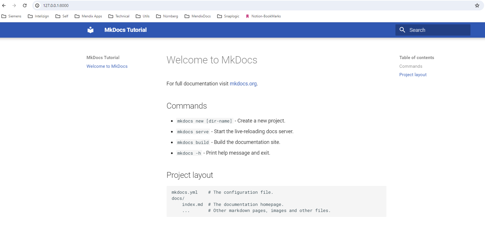

# Introduction

This is a sample repository that explains on how to setup and host a static documentation website on github pages.

We use Mkdocs material for this demonstration.

# Setup

```bash

# Create virtual env.
python -m venv venv

# Activate virtual env.
venv\Scripts\activate

# Install dependencies.
pip install mkdocs-material

# Create new mkdocs website.
# This creates two files namely mkdocs.yml and docs\index.md
mkdocs new .

# Serve the website
# Access the website on the url http://127.0.0.1:8000/
# This shall serve the website using the default mkdocs theme.
mkdocs serve

```

# Configuration

Configure the theme for our website. This shall apply Material theme to our website as shown below.

```yaml
site_name: MkDocs Tutorial
theme:
  name: material
```



Refer to the [mkdocs.yml](./mkdocs.yml) file for more configuration information.

Refer to the [docs](./docs/) folder for information related to documentation.

# Publishing to Github pages

# Troubleshooting

## Error - Required dependencies of "social" plugin not found

Install dependencies as suggested [here](https://github.com/squidfunk/mkdocs-material/discussions/3177#discussioncomment-3945283)

```bash
pip install mkdocs-material mkdocs-material-extensions --upgrade
pip install pillow cairosvg --upgrade

# For windows based operating system, it is recommended to install two more dependencies as indicated in the below link.
# https://github.com/squidfunk/mkdocs-material/issues/5121#issuecomment-1828600865
pip install pipwin
pipwin install cairocffi

```

# References

[Mkdocs](https://www.mkdocs.org/)

[Mkdocs Material](https://squidfunk.github.io/mkdocs-material/)
